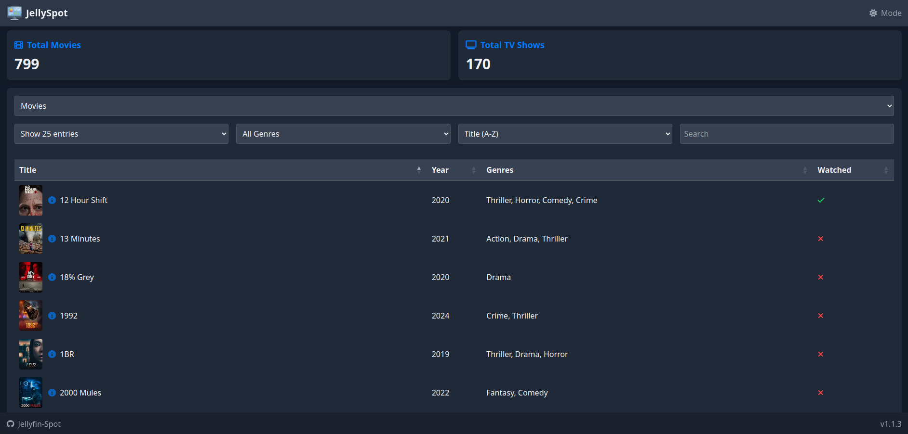

#  JellyfinSpot

JellyfinSpot: An elegant public interface for your Jellyfin media server. Showcase your media library with enhanced browsing and sorting capabilities.


<!-- Update other badges with your repository information -->

[Docker Hub](https://hub.docker.com/r/jontstaz/jellyfin-spot)



## ✨ Features

- **Rich Media Display**: Thumbnails for all movies and TV shows
- **Advanced Sorting Options**:
  - Alphabetical (A-Z, Z-A)
  - Release Date (Newest to Oldest, Oldest to Newest)
  - Recently Added
- **Watch Status Tracking**: 
  - ✓ Checkmark for watched content
  - ✗ Cross for unwatched content
- **Clean, Public-Facing Interface**: Perfect for sharing your library
- **Real-time Statistics**: Monitor library size and user activity
- **Responsive Design**: Works great on desktop and mobile

## 🚀 Quick Start

```bash
docker run -d --name jellyfin-spot \
  -p 8501:8501 \
  -e JELLYFIN_API_KEY=your_api_key_here \
  -e JELLYFIN_SERVER_URL=http://your_server_ip:8096 \
  jontstaz/jellyfin-spot
```

Access your dashboard at `http://localhost:8501`

## 🛠 Configuration

| Variable | Description | Required |
|----------|-------------|----------|
| `JELLYFIN_API_KEY` | Your Jellyfin API key | Yes |
| `JELLYFIN_SERVER_URL` | Your Jellyfin server URL | Yes |
| `DASHBOARD_TITLE` | Custom dashboard title | No |
| `DASHBOARD_ICON` | Custom dashboard icon URL | No |
| `DEBUG` | Enable debug mode (True/False) | No |

### Getting Your Jellyfin API Key
1. Log in to your Jellyfin server as an administrator
2. Go to Dashboard → API Keys
3. Create a new API key with appropriate permissions

## 📊 Docker Compose

```yaml
version: '3'
services:
  jellyfin-spot:
    image: jontstaz/jellyfin-spot
    ports:
      - "8501:8501"
    environment:
      - JELLYFIN_API_KEY=${JELLYFIN_API_KEY}
      - JELLYFIN_SERVER_URL=${JELLYFIN_SERVER_URL}
```

## 🔄 Differences from PlexSpot

This fork of PlexSpot has been completely adapted for Jellyfin and includes several enhancements:
- Full Jellyfin API integration
- Added thumbnail support for all media items
- Implemented comprehensive sorting options
- Added watch status indicators (✓/✗)
- Improved UI/UX for better media browsing
- Optimized performance for larger libraries

## 🤝 Contributing

Contributions are welcome! Feel free to:
- Report bugs
- Suggest new features
- Submit pull requests

## 📜 License

MIT License. See [LICENSE](LICENSE) for details.

---
*This project is a fork of [PlexSpot](https://github.com/ziadhorat/Plex-Spot), modified to work with Jellyfin Media Server and enhanced with additional features.*
